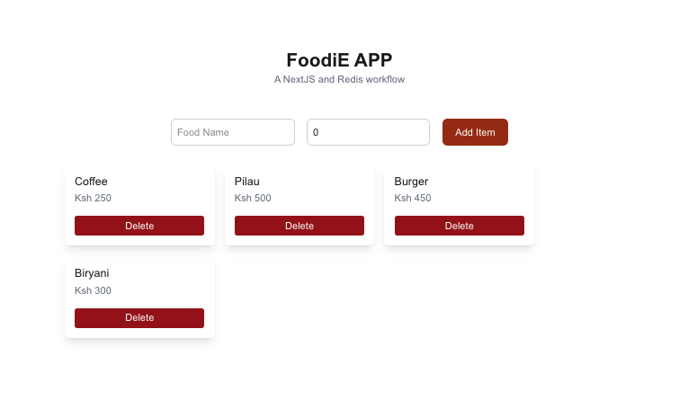

# FoodiE

A simple food listing app built with Next.js and Redis. You can add and delete items; data is stored in a Redis list.



## Tech Stack

- Next.js
- Tailwind CSS
- Redis (client `redis`)

## Prerequisites

- Node.js 18+
- A Redis instance (local or hosted)

## Setup

1. Install dependencies:

   ```bash
   npm install
   ```

2. Create a `.env` file at the project root and set the variables:

   ```bash
   REDIS_PASSWORD=""
   REDIS_HOST_URL="r"
   REDIS_PORT=0000
   REDIS_USERNAME=""
   ```

   Do not commit real secrets. `.env*` is ignored by Git in this repo.

## Scripts

- Development: `npm run dev`
- Build: `npm run build`
- Production: `npm run start`
- Lint: `npm run lint`

## Environment Variables

- `REDIS_HOST_URL` Redis host
- `REDIS_PORT` Redis port
- `REDIS_USERNAME` Redis username
- `REDIS_PASSWORD` Redis password

## How It Works

- Server actions write and read food items from a Redis list.
- Redis client configuration reads values from the environment.

## Troubleshooting

- Ensure the Redis host, port, username, and password are correct.
- If connection issues occur, verify network access to your Redis server.
